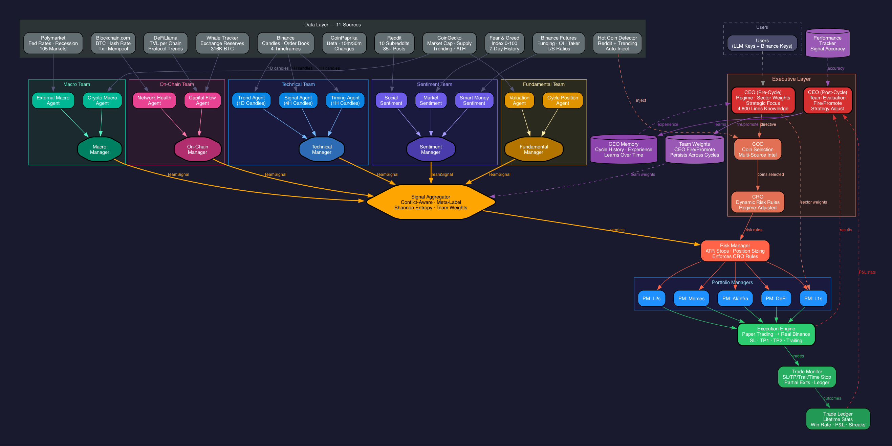

# HIVEMIND — Distributed AI Crypto Hedge Fund

A multi-agent AI system that analyzes the entire crypto market and executes trades using swarm intelligence. 12 specialized AI agents organized into 5 teams, each managed by a Team Manager, working together under a strategic CEO agent.

## Architecture



```
CEO (Pre-Cycle) → Intelligence Gathering → COO (Coin Selection) → CRO (Risk Rules)
                                                    ↓
                    ┌──────────────────────────────────────────────────────┐
                    │           5 Agent Teams × N Coins                    │
                    │                                                      │
                    │  Technical Team (3 agents)                           │
                    │    TrendAgent(1D) + SignalAgent(4H) + TimingAgent(1H)│
                    │    → Technical Manager → TeamSignal                  │
                    │                                                      │
                    │  Sentiment Team (3 agents)                           │
                    │    Social + Market + SmartMoney                      │
                    │    → Sentiment Manager → TeamSignal                  │
                    │                                                      │
                    │  Fundamental Team (2 agents)                         │
                    │    Valuation + CyclePosition                         │
                    │    → Fundamental Manager → TeamSignal                │
                    │                                                      │
                    │  Macro Team (2 agents)                               │
                    │    CryptoMacro + ExternalMacro                       │
                    │    → Macro Manager → TeamSignal                      │
                    │                                                      │
                    │  On-Chain Team (2 agents)                            │
                    │    NetworkHealth + CapitalFlow                        │
                    │    → On-Chain Manager → TeamSignal                   │
                    └──────────────────────────────────────────────────────┘
                                                    ↓
                    Signal Aggregator (conflict-aware, meta-label inspired)
                                                    ↓
                    Risk Manager (ATR-based stops, position sizing)
                                                    ↓
                    Portfolio Managers (per sector: L1s, DeFi, L2s, Memes)
                                                    ↓
                    Execution Engine (paper trading → real Binance)
                                                    ↓
                    Trade Monitor (SL/TP/trailing/time stops between cycles)
                                                    ↓
CEO (Post-Cycle) ← Trade Ledger (lifetime P&L, win rate, streaks)
```

## Key Design Principles

1. **Independence at signal generation, coordination at synthesis.** Agents within a team produce signals independently — they never see each other's output. The Team Manager synthesizes AFTER all agents commit.

2. **No HOLD escape.** Agents are forced to pick BULLISH or BEARISH (direction) with conviction 1-10. The SYSTEM decides whether to trade based on conviction. This prevents the LLM conservative bias.

3. **Multi-timeframe analysis.** Technical team uses Elder's Triple Screen: 1D (trend), 4H (signal), 1H (entry timing). Different teams operate at different natural frequencies.

4. **Real data, not stubs.** 11 data sources: Binance (spot + futures), Reddit (10 subreddits), Fear & Greed, CoinGecko, CoinPaprika, DeFiLlama, Blockchain.com, Polymarket, whale tracking.

5. **CEO with institutional knowledge.** 4,800+ lines of crypto market history (2012-2026), including every major cycle, halving pattern, F&G historical signals, sector rotation playbooks.

## Data Sources (11, all free)

| Source | Data | Feeds |
|--------|------|-------|
| Binance Spot | Candles (1H/4H/1D/1W), 24h stats, order book | Technical team |
| Binance Futures | Funding rates, OI, taker flow, L/S ratios | Technical + Sentiment |
| Reddit | 85 posts from 10 subreddits, coin mentions | Sentiment team |
| Fear & Greed | Index 0-100, 7-day history | Sentiment team |
| CoinGecko | Market cap, supply, ATH, trending, global data | Fundamental + Macro |
| CoinPaprika | Beta values, 15m/30m changes | Fundamental team |
| Blockchain.com | BTC network power, tx count, mempool | On-Chain team |
| DeFiLlama | TVL per chain, protocol trends | On-Chain team |
| Polymarket | 105 prediction markets (Fed, recession, crypto) | Macro team |
| Whale Tracker | Exchange BTC wallet balances | On-Chain team |
| Hot Coin Detector | Reddit + trending cross-reference | COO (auto-inject) |

## Executive Layer

| Role | What It Does |
|------|-------------|
| **CEO (Pre-Cycle)** | Sets regime (BULL/BEAR/RANGING/CRISIS), sector weights, strategic focus. Has 4,800 lines of crypto history knowledge + cycle memory. |
| **CEO (Post-Cycle)** | Reviews all results, evaluates teams, fire/promote decisions, strategy adjustments. Feedback persists to next cycle. |
| **COO** | Selects which coins to analyze. Uses Binance + CoinGecko + Reddit + DeFiLlama intelligence. |
| **CRO** | Dynamically sets risk rules per cycle: max position %, drawdown limits, confidence thresholds. |

## Trade Management

Every trade has ATR-based parameters calculated BEFORE entry:

| Parameter | BTC | Top 5 | Large Cap | Mid Cap | Meme |
|-----------|-----|-------|-----------|---------|------|
| Stop Loss | 2.0x ATR | 2.5x ATR | 3.0x ATR | 3.5x ATR | 4.5x ATR |
| Trail | 2.5x ATR | 3.0x ATR | 3.5x ATR | 4.0x ATR | 5.0x ATR |
| Risk/Trade | 1.5% | 1.2% | 1.0% | 0.75% | 0.25% |
| Max Position | 20% | 12% | 8% | 5% | 2% |
| Max Hold | 450h | 300h | 210h | 150h | 60h |

Tiered exits: sell 33% at TP1, 33% at TP2, trail the remainder.

## Persistent State

```
data/
├── ceo_memory.json           # CEO experience across cycles
├── team_weights.json         # CEO fire/promote decisions
├── open_trades.json          # Active positions with SL/TP params
├── trade_ledger.json         # Complete trade history
├── performance_history.json  # Signal accuracy tracking
```

## Project Structure

```
hivemind/
├── agents/
│   ├── base.py                    # BaseAgent + BaseLLMCaller + SIGNAL_TOOL
│   ├── team_manager.py            # BaseTeamManager + TEAM_SIGNAL_TOOL
│   ├── technical/
│   │   ├── trend_agent.py         # 1D trend analysis
│   │   ├── signal_agent.py        # 4H setup identification
│   │   ├── timing_agent.py        # 1H entry timing
│   │   ├── technical_manager.py   # Synthesizes 3 timeframes
│   │   ├── technical_agent.py     # Pre-compute scores (shared)
│   │   └── manager_knowledge.md   # Elder's Triple Screen, alignment rules
│   ├── sentiment/
│   │   ├── social_agent.py        # Reddit, trending
│   │   ├── market_agent.py        # F&G, crowd positioning
│   │   ├── smart_money_agent.py   # Funding, L/S, whale divergence
│   │   ├── sentiment_manager.py   # Synthesizes 3 sources
│   │   └── manager_knowledge.md   # Source reliability hierarchy
│   ├── fundamental/
│   │   ├── valuation_agent.py     # Market cap, FDV, supply
│   │   ├── cycle_agent.py         # SMA200 cycle position
│   │   ├── fundamental_manager.py # Synthesizes valuation + cycle
│   │   └── manager_knowledge.md   # Value trap rules
│   ├── macro/
│   │   ├── crypto_macro_agent.py  # BTC dominance, market cap
│   │   ├── external_macro_agent.py# Polymarket, Fed, derivatives
│   │   ├── macro_manager.py       # Synthesizes crypto + external
│   │   └── manager_knowledge.md   # Fed transmission, rotation
│   └── onchain/
│       ├── network_agent.py       # Network power, tx, mempool
│       ├── capital_flow_agent.py  # Whale flows, TVL trends
│       ├── onchain_manager.py     # Synthesizes health + flows
│       └── manager_knowledge.md   # TVL significance, flow rules
├── aggregator/
│   └── signal_aggregator.py       # Conflict-aware, meta-label inspired
├── data/
│   ├── data_layer.py              # 11-source data fetcher + team slicing
│   ├── binance_client.py          # Spot + order book
│   ├── derivatives.py             # Futures: funding, OI, taker, L/S
│   ├── reddit.py                  # 10 subreddits, keyword analysis
│   ├── fear_greed.py              # Alternative.me F&G Index
│   ├── coingecko.py               # Global, per-coin, trending
│   ├── coinpaprika.py             # Beta, short-term changes
│   ├── blockchain.py              # BTC on-chain stats
│   ├── defi_llama.py              # TVL, protocol trends
│   ├── polymarket.py              # Prediction markets
│   ├── whales.py                  # Exchange wallet tracking
│   ├── hot_coins.py               # Auto-detection of hot coins
│   ├── models.py                  # All Pydantic models
│   └── technical_indicators.py    # RSI, MACD, BB, SMA, ATR
├── executive/
│   ├── ceo_agent.py               # Pre-cycle directive + post-cycle review
│   ├── ceo_memory.py              # Persistent cycle learning
│   ├── ceo_knowledge_base.md      # Layer 1: Market cycles
│   ├── knowledge/                 # Layers 2-6:
│   │   ├── trading_patterns.md    #   160+ micro-patterns
│   │   ├── sector_deep_dives.md   #   7 sectors analyzed
│   │   ├── coin_profiles.md       #   Top 50 coin profiles
│   │   ├── behavioral_finance.md  #   Crowd psychology
│   │   └── market_microstructure.md # Exchange/derivative mechanics
│   ├── coo_agent.py               # Coin selection
│   ├── cro_agent.py               # Dynamic risk rules
│   ├── perf_agent.py              # (deprecated — CEO handles)
│   └── team_weights.py            # Persistent team weight manager
├── risk/
│   ├── risk_manager.py            # Enforces CRO rules
│   └── trade_params.py            # ATR-based SL/TP/trailing calculator
├── portfolio/
│   └── manager.py                 # Per-sector allocation (L1s, DeFi, Memes)
├── execution/
│   ├── paper_trader.py            # Virtual portfolio
│   ├── trade_monitor.py           # SL/TP/time stop checker between cycles
│   └── trade_ledger.py            # Complete trade history + stats
├── evaluation/
│   └── performance_tracker.py     # Signal accuracy over time
├── display.py                     # Terminal UI (ANSI colors, badges)
├── config.py                      # Settings from .env
└── main.py                        # Pipeline orchestrator
```

## Quick Start

```bash
# Clone
git clone https://github.com/osama-2298/hivemind.git
cd hivemind

# Setup
python3 -m venv .venv
source .venv/bin/activate
pip install -e .

# Configure
cp .env.example .env
# Add your ANTHROPIC_API_KEY to .env

# Run
python -m hivemind.main
```

## Requirements

- Python 3.12+
- Anthropic API key (Claude Opus 4.6)
- No Binance API key needed for paper trading (public endpoints only)

## What's Next

- [ ] Continuous loop (run every 4 hours automatically)
- [ ] WhatsApp signal delivery (user replies YES/NO to approve trades)
- [ ] Real Binance execution (authenticated trading)
- [ ] Dashboard ("The Theater" — live agent feed, leaderboards)
- [ ] Database persistence (PostgreSQL)
- [ ] API backend (FastAPI)
